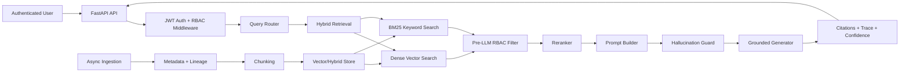

# Enterprise RAG Intelligence

[](https://github.com/anan5093/Enterprise-RAG-Intelligence/actions/workflows/ci.yml)


Secure, enterprise-ready Retrieval-Augmented Generation (RAG) platform with RBAC-first retrieval, multi-source ingestion, explainable responses, and audit-friendly operations.

## Table of Contents

- [What this project does](#what-this-project-does)
- [Why this project is useful](#why-this-project-is-useful)
- [Architecture](#architecture)
- [Project structure](#project-structure)
- [How to get started](#how-to-get-started)
- [Usage examples](#usage-examples)
- [Documentation](#documentation)
- [Where to get help](#where-to-get-help)
- [Who maintains and contributes](#who-maintains-and-contributes)
- [License](#license)

## What this project does

Enterprise RAG Intelligence is a full-stack secure RAG system designed for organizations that need controlled, auditable access to internal knowledge bases:

- **Backend**: FastAPI service for authentication, ingestion, query, Prometheus metrics, and audit logs.
- **Retrieval**: Hybrid vector + BM25 keyword retrieval with reranking and source routing.
- **Security**: JWT authentication and pre-generation RBAC filtering — unauthorized chunks are excluded before any prompt is constructed.
- **Generation**: Grounded, extractive answers with citations, confidence scoring, and retrieval trace metadata.
- **Frontend**: Next.js UI for secure chat, multi-source document ingestion, and admin audit monitoring.
- **Observability**: Prometheus metrics endpoint (`/metrics`) with an optional Grafana dashboard via Docker Compose.

## Why this project is useful

Key benefits for enterprise AI teams:

- **Security-first data access**: RBAC checks happen before generation, so the LLM never sees restricted evidence.
- **Grounded outputs**: every answer is tied to retrieved, cited chunks; low-confidence or missing evidence returns `Insufficient authorized data available.`
- **Explainability by default**: trace metadata includes route decisions, authorized chunk IDs, denied counts, and filters applied.
- **Multi-source ingestion**: supports CSV, JSON, PDF, DOCX, SQL, and KB-style text/Markdown.
- **Operational visibility**: structured audit logs and Prometheus metrics out of the box.
- **Deployment-ready assets**: Docker, Docker Compose (with Prometheus + Grafana), and Kubernetes manifests.

## Architecture



See [docs/architecture.md](docs/architecture.md) for a detailed breakdown of each layer.

## Project structure

```text
backend/app/
  api/              FastAPI routes and dependencies
  core/             app config, logging, rate limiting
  ingestion/        loaders, chunking, metadata pipeline
  retrieval/        vector store, hybrid search, reranking, routing
  security/         auth, RBAC, policy checks, audit logging
  generation/       prompt building, guardrails, response synthesis
  explainability/   provenance, confidence, trace components
  observability/    Prometheus metrics
frontend/
  app/              Next.js App Router pages (login/chat/upload/admin)
  components/       UI components (trace, dashboard, shell, cards)
  lib/              API/session utilities
examples/
  data/             sample enterprise datasets (CSV, JSON, Markdown)
  prompts/          prompt templates
  policies/         sample RBAC policy
deploy/
  k8s/              Kubernetes manifests
  prometheus.yml    Prometheus scrape config
docs/
  architecture.md   architecture overview
  api.md            endpoint docs and payloads
  security.md       RBAC/security model
```

## How to get started

### Prerequisites

| Tool | Minimum version |
|------|----------------|
| Python | 3.12 |
| Node.js | 22 |
| npm | bundled with Node.js |
| Docker + Docker Compose | any recent release (optional) |

---

### Option A — Local development

#### 1. Start the backend

```bash
cd backend
python -m venv .venv
source .venv/bin/activate        # Windows: .venv\Scripts\activate
pip install -r requirements.txt
uvicorn app.main:app --reload --host 0.0.0.0 --port 8000
```

Backend base URL: `http://localhost:8000`  
Interactive API docs: `http://localhost:8000/docs`

#### 2. Start the frontend

Open a new terminal:

```bash
cd frontend
npm install
NEXT_PUBLIC_API_BASE_URL=http://localhost:8000 npm run dev
```

Frontend URL: `http://localhost:3000`

#### 3. (Optional) Preload bundled example data

```bash
cd backend
python -m app.scripts.ingest_examples
```

This writes/updates the local FAISS index under `runtime/faiss_index/` using the datasets in `examples/data/`.

#### 4. Run checks

From the repository root:

```bash
pytest backend/tests
cd frontend && npm run build
```

---

### Option B — Docker Compose (recommended for a full stack)

```bash
docker compose up --build
```

This starts four services:

| Service | URL |
|---------|-----|
| Backend (FastAPI) | `http://localhost:8000` |
| Frontend (Next.js) | `http://localhost:3000` |
| Prometheus | `http://localhost:9090` |
| Grafana | `http://localhost:3001` (default credentials: `admin` / `admin`) |

The backend must pass its health check before the frontend starts.

---

### Option C — Kubernetes

Manifests are in [`deploy/k8s/`](deploy/k8s/). Apply them to your cluster:

```bash
kubectl apply -f deploy/k8s/secrets.example.yaml   # configure secrets first
kubectl apply -f deploy/k8s/backend.yaml
kubectl apply -f deploy/k8s/frontend.yaml
```

## Usage examples

### Demo accounts (local development only)

> ⚠️ The credentials below are for local development only. Replace them with real identity-provider integration before any shared or production deployment. The demo accounts are defined in `backend/app/security/auth.py` (`DEMO_USERS`).

| Username | Role |
|----------|------|
| `admin` | Admin |
| `fin_user` | Finance |
| `eng_user` | Engineering |
| `comp_user` | Compliance |
| `guest` | Guest |

Default passwords follow the pattern shown in [`docs/api.md`](docs/api.md).

---

### Login and query via API

```bash
# Authenticate and capture the token
TOKEN=$(curl -s -X POST http://localhost:8000/login \
  -H "Content-Type: application/json" \
  -d '{"username":"admin","password":"admin-change-me"}' \
  | python3 -c "import sys,json; print(json.load(sys.stdin)['access_token'])")

# Query with the token
curl -s -X POST http://localhost:8000/query \
  -H "Authorization: Bearer $TOKEN" \
  -H "Content-Type: application/json" \
  -d '{"query":"Show critical security alerts"}'
```

A successful query response includes `answer`, `citations`, `confidence`, and a `trace` object with routing and RBAC filter details.

### Ingest a source

```bash
curl -s -X POST http://localhost:8000/ingest \
  -H "Authorization: Bearer $TOKEN" \
  -H "Content-Type: application/json" \
  -d '{
    "path": "examples/data/security_alerts.json",
    "source_type": "json",
    "department": "compliance",
    "owner": "compliance",
    "confidentiality": "confidential",
    "allowed_roles": ["Admin", "Compliance"],
    "rbac_tags": ["compliance", "alerts"]
  }'
```

See [`docs/api.md`](docs/api.md) for the full list of `source_type` values and field descriptions.

### View audit logs

```bash
curl -s http://localhost:8000/audit-logs \
  -H "Authorization: Bearer $TOKEN"
```

Requires the `Admin` or `Compliance` role.

## Documentation

| Document | Description |
|----------|-------------|
| [docs/architecture.md](docs/architecture.md) | Pipeline design and layer responsibilities |
| [docs/api.md](docs/api.md) | All endpoint payloads and response formats |
| [docs/security.md](docs/security.md) | RBAC model, policy checks, and denial semantics |
| [deploy/k8s/](deploy/k8s/) | Kubernetes deployment manifests |

## Where to get help

- **Bugs and feature requests**: open a [GitHub issue](https://github.com/anan5093/Enterprise-RAG-Intelligence/issues) with reproduction steps and relevant logs.
- **API reference**: see [`docs/api.md`](docs/api.md).
- **RBAC and security model**: see [`docs/security.md`](docs/security.md).
- **Pipeline design**: see [`docs/architecture.md`](docs/architecture.md).

## Who maintains and contributes

### Maintainer

- [Anand Raj (@anan5093)](https://github.com/anan5093)

### Contributing

Contributions are welcome via pull requests:

1. Fork the repository and create a feature branch.
2. Make your changes and run `pytest backend/tests` plus `cd frontend && npm run build`.
3. Submit a PR with a clear summary and validation notes.

If you plan a major change, open an issue first to align on scope.

## License

[MIT License](LICENSE) — Copyright © 2026 Anand Raj
