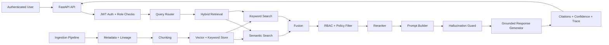

# Enterprise RAG Intelligence

[](https://github.com/anan5093/Enterprise-RAG-Intelligence/actions/workflows/ci.yml)


**Secure Enterprise RAG Platform for Zero-Trust Retrieval, RBAC Enforcement, and Grounded Generation.**

Enterprise RAG Intelligence is a full-stack enterprise AI infrastructure project for secure Retrieval-Augmented Generation (RAG) over internal knowledge. It combines hybrid retrieval (FAISS semantic + keyword search), pre-generation RBAC filtering, grounded response synthesis, explainability traces, and an enterprise web console for chat, ingestion, and governance.

---

## Table of Contents

- [What the project does](#what-the-project-does)
- [Why the project is useful](#why-the-project-is-useful)
- [How users can get started](#how-users-can-get-started)
- [Usage examples](#usage-examples)
- [Screenshots](#screenshots)
- [Where users can get help](#where-users-can-get-help)
- [Who maintains and contributes](#who-maintains-and-contributes)
- [License](#license)

## What the project does

This repository provides an enterprise-grade secure RAG system with a security-first architecture:

- **FastAPI backend** for authentication, query orchestration, ingestion, health, metrics, and audit endpoints
- **Pre-LLM authorization boundary** enforced with RBAC/attribute-aware policy checks during retrieval
- **Hybrid retrieval pipeline** (semantic + keyword + fusion + reranking) with route-aware source selection
- **Grounded generation** with refusal behavior when authorized evidence is insufficient
- **Explainability outputs** with citations, confidence scoring, and retrieval traces
- **Enterprise frontend (Next.js)** with login, secure chat, source registration, and governance dashboard
- **Operational assets** for Docker Compose, Kubernetes manifests, and Prometheus/Grafana integration

### Enterprise feature highlights

- RBAC enforcement before prompt assembly
- Hybrid retrieval with dense semantic + sparse keyword recall
- FAISS-backed semantic index persistence
- Grounded generation with citations and confidence
- Explainability traces with route and filter metadata
- Multi-source ingestion: CSV, JSON, PDF, DOCX, SQL, knowledge base text
- Audit logging for login/query/ingestion flows
- Enterprise UI for chat, ingestion, and security operations
- Prompt-injection-aware prompt design and refusal behavior
- OWASP-aware secure retrieval architecture

### Architecture overview



### Security and RBAC (critical boundary)

The core security invariant of this project is:

> **The LLM receives only authorized chunks.**

Security enforcement flow:

1. Retrieval may return relevant candidates from mixed-sensitivity sources.
2. Policy enforcement (`RBAC + department + sensitivity`) runs before prompt construction.
3. Unauthorized chunks are denied and excluded.
4. Prompt/generation/explainability operate on authorized chunks only.
5. If no authorized evidence remains, the system returns: `Insufficient authorized data available.`

Why this matters for enterprise AI security:

- Prevents sensitive-information disclosure through accidental prompt context leakage
- Enforces zero-trust retrieval-to-generation boundaries
- Supports auditability via denial counts and structured traces

### OWASP Top 10 for LLM Applications alignment

| OWASP LLM risk area | Repository mitigation |
|---|---|
| Prompt Injection | Static prompt structure, bounded query insertion, guard-based refusal behavior |
| Sensitive Information Disclosure | Pre-generation RBAC/policy filtering; denied content never reaches prompt |
| Hallucination / Ungrounded Output | Grounded synthesis + citations + confidence + explicit insufficient-data refusal |
| Insecure Output Handling | Guard/sanitization stage before final answer response |
| Excessive Agency | Read-only assistant flow with no autonomous action execution |
| Insecure Retrieval | Hybrid retrieval with policy filtering and traceable authorization decisions |

## Why the project is useful

Enterprise RAG fails when retrieval security, explainability, and operational trust are treated as add-ons. This project focuses on those as first-class design goals:

- **Secure retrieval first**: authorization is enforced before any LLM context assembly
- **Grounded and explainable**: responses include source citations, confidence, and retrieval traces
- **Built for heterogeneous enterprise data**: supports logs, docs, datasets, and knowledge bases
- **Auditable by design**: query and ingestion actions are logged for governance
- **Production-oriented architecture**: local, Docker, and Kubernetes deployment paths

### Explainability and grounded generation

Each successful query response includes:

- **Answer** synthesized from authorized evidence only
- **Citations** for source-level provenance (`chunk_id`, source, optional page/table/row)
- **Confidence score** (`0.0`–`1.0`) derived from evidence quality signals
- **Trace metadata** including routing, candidate/authorized/denied chunk IDs, filters, and latency

When evidence is insufficient or unauthorized, the system refuses instead of hallucinating.

### Engineering challenges and lessons learned

Key implementation lessons from real development/debugging work ([docs/Challenges.md](docs/Challenges.md)):

- Windows dependency friction led to migration from Chroma to FAISS
- FAISS path resolution issues caused runtime empty retrieval behavior
- Metadata deserialization mismatches caused silent retrieval failures
- RBAC enum/string mismatches produced over-denial until normalization was fixed
- UI/backend mismatch (upload semantics) required source-registration reframing
- Frontend auth flashing required auth-aware redirect sequencing
- API base URL mismatches caused frontend fetch failures
- Grounded response quality improved by separating answer synthesis from internal chunk dumps

## How users can get started

### Prerequisites

- Python 3.12+
- Node.js 22+
- npm
- Docker + Docker Compose (optional)
- Kubernetes + kubectl (optional)

### Option A: Local development

1. **Clone and install backend dependencies**

```bash
git clone https://github.com/anan5093/Enterprise-RAG-Intelligence.git
cd Enterprise-RAG-Intelligence

cd backend
python -m venv .venv
source .venv/bin/activate  # Windows: .venv\Scripts\activate
pip install -r requirements.txt
```

2. **Run backend**

```bash
cd backend
uvicorn app.main:app --reload --host 0.0.0.0 --port 8000
```

3. **Run frontend** (new terminal)

```bash
cd frontend
npm install
NEXT_PUBLIC_API_BASE_URL=http://localhost:8000 npm run dev
```

4. **Optional: ingest bundled sample data**

```bash
cd backend
python -m app.scripts.ingest_examples
```

Local endpoints:

- Frontend: `http://localhost:3000`
- Backend API: `http://localhost:8000`
- OpenAPI docs: `http://localhost:8000/docs`
- Metrics: `http://localhost:8000/metrics`

### Option B: Full stack with Docker Compose

```bash
# from repository root
docker compose up --build
```

Services:

- Frontend: `http://localhost:3000`
- Backend: `http://localhost:8000`
- Prometheus: `http://localhost:9090`
- Grafana: `http://localhost:3001` (default `admin` / `admin`)

### Option C: Kubernetes

```bash
kubectl apply -f deploy/k8s/secrets.example.yaml
kubectl apply -f deploy/k8s/backend.yaml
kubectl apply -f deploy/k8s/frontend.yaml
```

### Validate your setup

From repository root:

```bash
pytest backend/tests
cd frontend && npm install && npm run build
```

## Usage examples

### 1) Authenticate and get JWT

```bash
curl -s -X POST http://localhost:8000/login \
  -H "Content-Type: application/json" \
  -d '{"username":"admin","password":"admin-change-me"}'
```

### 2) Run a secure query

```bash
TOKEN="<paste_access_token>"
curl -s -X POST http://localhost:8000/query \
  -H "Authorization: Bearer $TOKEN" \
  -H "Content-Type: application/json" \
  -d '{"query":"Show critical security alerts"}'
```

### 3) Ingest a source with RBAC metadata

```bash
curl -s -X POST http://localhost:8000/ingest \
  -H "Authorization: Bearer $TOKEN" \
  -H "Content-Type: application/json" \
  -d '{
    "path": "examples/data/security_alerts.json",
    "source_type": "json",
    "department": "compliance",
    "owner": "compliance",
    "confidentiality": "confidential",
    "allowed_roles": ["Admin", "Compliance"],
    "rbac_tags": ["compliance", "alerts"]
  }'
```

### API overview (concise)

| Endpoint | Purpose | Auth |
|---|---|---|
| `POST /login` | Authenticate and return bearer token + principal | Public |
| `POST /query` | Run secure RAG query (`answer`, `citations`, `confidence`, `trace`) | JWT |
| `POST /ingest` | Register/index source with metadata and allowed roles | JWT (`Admin`/`Compliance`) |
| `GET /audit-logs` | Read recent audit events | JWT (`Admin`/`Compliance`) |
| `GET /health` | Service health | Public |
| `GET /metrics` | Prometheus metrics | Public (restrict in prod) |

For full endpoint details and schemas, see [docs/api.md](docs/api.md).

## Screenshots

### Login UI


### Grounded chat and retrieval trace


### Source registration and ingestion console


### Governance and audit dashboard


## Where users can get help

### Documentation links

- Requirements: [docs/Requirements.md](docs/Requirements.md)
- Design: [docs/Design.md](docs/Design.md)
- Architecture: [docs/architecture.md](docs/architecture.md)
- API Reference: [docs/api.md](docs/api.md)
- Security & RBAC: [docs/security.md](docs/security.md)
- Engineering Challenges: [docs/Challenges.md](docs/Challenges.md)
- Technical blog deep dive: [docs/Enterprise rag intelligence blog.md](docs/Enterprise%20rag%20intelligence%20blog.md)

### Project structure

```text
Enterprise-RAG-Intelligence/
├── backend/
│   ├── app/
│   │   ├── api/               # FastAPI routes and dependencies
│   │   ├── core/              # config, logging, rate limiting
│   │   ├── security/          # auth, RBAC, policy engine, audit logging
│   │   ├── ingestion/         # loaders, chunking, metadata pipeline
│   │   ├── retrieval/         # router, hybrid search, reranker, vector store
│   │   ├── generation/        # prompt builder, guard, response synthesis
│   │   ├── explainability/    # trace/confidence/provenance helpers
│   │   ├── observability/     # Prometheus metrics
│   │   └── services/          # query + ingestion orchestration
│   ├── tests/
│   └── requirements.txt
├── frontend/
│   ├── app/                   # login, chat, upload, admin pages
│   ├── components/            # shell, cards, trace/dashboard components
│   ├── lib/                   # API client + session utilities
│   └── types/
├── docs/                      # architecture, design, security, API, challenges
│   └── screenshots/
├── examples/
│   ├── data/                  # sample enterprise datasets
│   ├── policies/
│   └── prompts/
├── deploy/
│   ├── k8s/                   # backend/frontend manifests + secrets template
│   └── prometheus.yml
├── runtime/                   # persisted FAISS index + runtime artifacts
├── docker-compose.yml
├── Dockerfile.backend
└── Dockerfile.frontend
```

### Production hardening notes

Implemented in repository:

- JWT-based authentication and role-bearing principals
- Pre-generation RBAC/ABAC-style chunk authorization
- Structured audit log writing and restricted audit endpoint
- Rate-limit middleware support
- Prometheus metrics and health checks
- Docker/Kubernetes deployment assets

Recommended for production environments:

- OIDC/SAML integration (replace demo user store)
- Policy-as-code (e.g., OPA/Rego) with versioned controls
- Immutable encrypted audit log retention
- Managed vector DB with tenant isolation and private networking
- JWT key rotation and secret manager integration
- API gateway/WAF controls and tighter `/metrics`/`/docs` exposure policy

- Support issues and feature requests: https://github.com/anan5093/Enterprise-RAG-Intelligence/issues

## Who maintains and contributes

### Maintainer

- Anand Raj ([@anan5093](https://github.com/anan5093))

### Contributions

Contributions are welcome and encouraged:

1. Open an issue describing the bug, enhancement, or architecture proposal.
2. Create a focused branch and keep changes scoped.
3. Validate changes locally:
   - `pytest backend/tests`
   - `cd frontend && npm install && npm run build`
4. Open a pull request with a clear summary and validation notes.

### Security disclosure

If you identify a security issue (RBAC bypass, auth weakness, prompt-injection bypass, sensitive-data exposure), please open a private/coordinated report with the maintainer before public disclosure.

### Credits

Thanks to contributors, reviewers, and the broader open-source AI security and RAG engineering community for ideas around secure retrieval, explainability, and trustworthy enterprise AI design.

## License

Licensed under the [MIT License](LICENSE).
