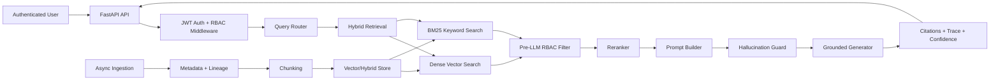

# Enterprise Secure Multi-Source RAG Architecture

## Layer Responsibilities

- Ingestion loads PDF, CSV, JSON, SQL, and knowledge-base files, extracts metadata, assigns lineage IDs, and chunks content.
- Retrieval combines semantic search and keyword search with reciprocal rank fusion, source routing, metadata filtering, and reranking.
- Security is enforced before generation. Unauthorized chunks are excluded before prompt construction, so the LLM never sees restricted evidence.
- Generation is grounded and extractive by default. Missing or low-confidence evidence returns `Insufficient authorized data available.`
- Explainability returns route decisions, authorized chunk IDs, denied counts, filters applied, citations, and confidence.
- Observability exposes Prometheus metrics and appends structured audit events.

